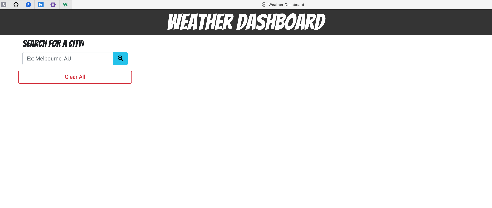
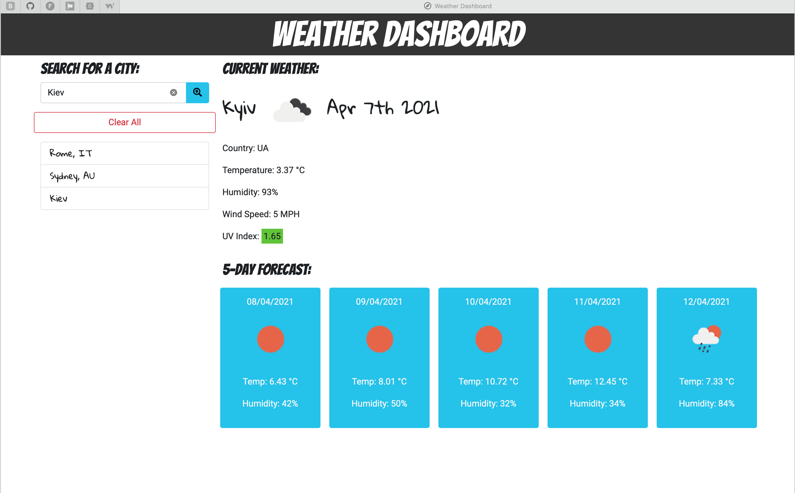
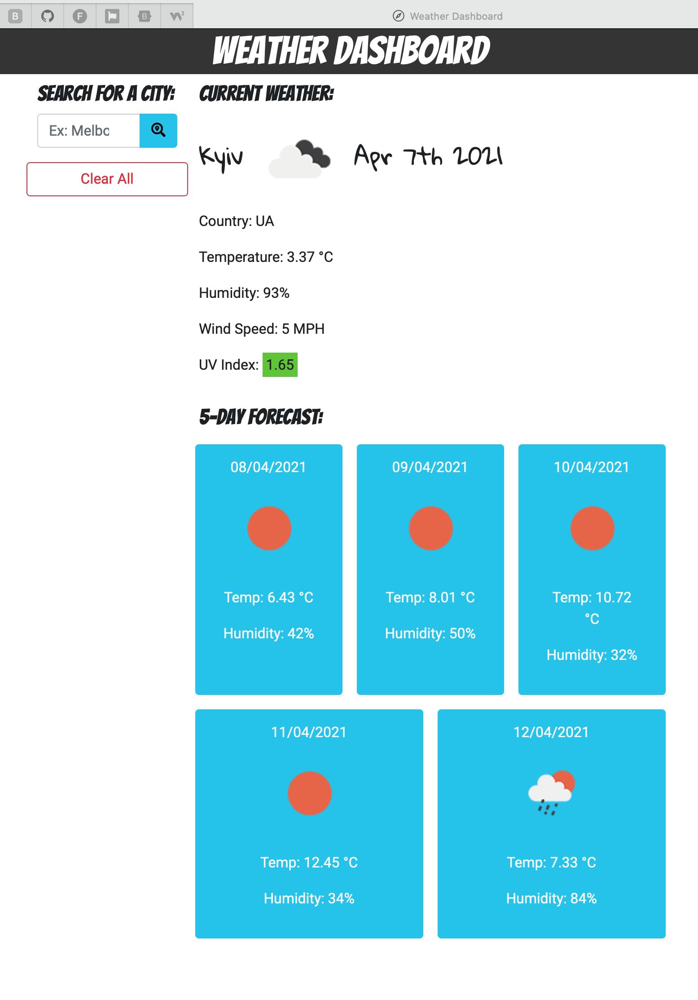

# Week6-A-Weather-Dashboard
* Coding Bootcamp - Assignment - Week 6 - Weather Dashboard

## Table of Contents
* [General Info](#general-info)
* [Live URL](#live-url)
* [Walkthrough](#walkthrough)
* [Webpage Preview](#webpage-preview)
* [Contributing](#contributing)
* [Notes](#notes)

 

## General Info
The task of this assignment was to build a weather dashboard that will run in the browser and feature dynamically updated HTML and CSS powered by JavaScript with use of jQuery, Bootstrap and Moment.js all together, and retrieve
data from 3rd party API [OpenWeather API](https://openweathermap.org/api).

 

### Live URL
https://korolyovalara.github.io/Weather-Dashboard/

 

## Walkthrough
- When you load the webpage for the first time, you will be presented a weather dashboard with search input;
- When you search for a city, then you will be presented with current weather and 5-day forecast for that city, and that city is added to the search history below “Clear All” button;
- When you view current weather conditions for the city, then you are presented with the city name, the date, an icon representation of weather conditions, the temperature, the humidity, the wind speed, and the UV index;
    - UV index is color-coded, as per worldwide standards, to indicate UV radiation levels into:
         -  `#65cc1e` - Low           <2
         -  `#ffde32` - Moderate      3 to
         -  `#ffa500` - High          6 to
         -  `#e60073` - Very high     8 to
         -  `#9572ff` - Expreme       11+ 

- When you view future weather conditions for the city, then you are presented with a 5-day forecast that displays the date, an icon representation of weather conditions, the  temperature, and the humidity;
- When you click on a city in the search history, then you are again presented with current and future conditions for that city;
- If you reload the page, or close it and come back later, then you will be presented with current and future conditions for the last city that you searched for;
    - Unless you press “Clear All” button, then all history will be deleted.

Enjoy!

 

## Webpage Preview
The following images show the web application's appearance.

 

## Contributing
Pull requests are welcome. For major changes, please open an issue first to discuss what you would like to change, so I learn and understand it better.

Please make sure to update tests as appropriate.
 

## Notes
Quote that recently inspired me:

    “Give yourself another day, another chance. 
    You will find your courage eventually. 
    Don’t give up on yourself just yet.”
    –Someone

---
© 2021 L Korolyova
